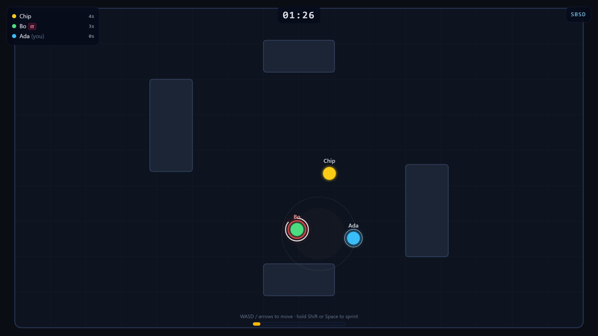
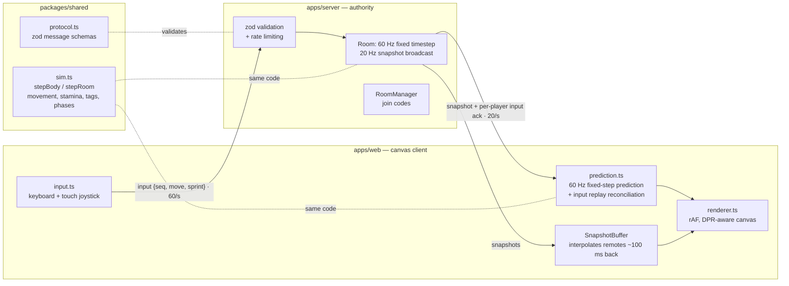

# tag-game

Multiplayer tag in the browser with an **authoritative Socket.IO server** — rooms with join
codes, 60 Hz server simulation, client prediction, snapshot interpolation and mobile touch
controls.

[](https://github.com/jeeanribeiro/tag-game/actions/workflows/ci.yml)
[](LICENSE)



_A real round, captured mid-tag: the white flash is the tag landing on Bo, the red ring is the
chaser glow, and the thin arc is his tag cooldown draining. Score is the time you spend NOT
being "it"._

## Features

- **Authoritative server** — clients send key state only; position, speed, stamina, collisions
  and tags are computed exclusively on the server at a fixed 60 Hz timestep.
- **Rooms with join codes** — create a room, share the 4-letter code (or the `#CODE` link).
- **Client prediction + reconciliation** — your own movement is instant; the server ack replays
  unconfirmed inputs so corrections are invisible in normal play.
- **Snapshot interpolation** — remote players render ~100 ms in the past, interpolated between
  20 Hz snapshots; no extrapolation, so packet loss never causes overshoot.
- **Sprint stamina** — hold Shift/Space to sprint; stamina drains and regenerates server-side
  (this mechanic replaces a space-bar speed _hack_ that shipped in the original client).
- **Rounds, scores, podium** — 90-second rounds, score = time not being "it", podium screen
  between rounds, spectator mode for mid-round joiners.
- **Game feel** — chaser glow, tag flash + screen shake, cooldown arc, dark arena, obstacles.
- **Mobile** — dynamic-origin touch joystick plus a sprint button.
- **Legible anti-cheat** — zod-validated messages, token-bucket input rate limiting, bounded
  input queues. Editing client state in devtools moves pixels, not the game.

## Quickstart

Requires Node >= 24 and pnpm.

```bash
git clone https://github.com/jeeanribeiro/tag-game.git
cd tag-game
pnpm install
pnpm build
pnpm start          # serves the game on http://localhost:3000
```

Open two browser tabs, create a room in one, join with the code in the other.

## Architecture

pnpm workspace with one simulation shared by both sides:



- `packages/shared` — deterministic simulation core (movement integration, circle-vs-rect
  obstacle resolution, sprint stamina with hysteresis, tag + cooldown rules, the round phase
  machine) plus the zod wire schemas. Pure functions, unit-tested in isolation.
- `apps/server` — Express 5 + Socket.IO 4. Each room runs a fixed-timestep loop (an
  accumulator turns wall time into exact 16.67 ms steps) and broadcasts a snapshot every third
  tick. Empty rooms are garbage-collected.
- `apps/web` — Vite + TypeScript canvas client. No framework: a rAF loop, a snapshot buffer,
  a predictor and DOM overlays (Tailwind) for menu/HUD/podium.

## Netcode notes

**Why an authoritative server?** The original version of this game trusted the client with its
own position _and speed_ — holding space set `speed = 20` in client code, and teleporting was a
one-line devtools edit. The rewrite inverts the trust: the only thing a client can say is
"my keys look like this" (`{seq, moveX, moveY, sprint}`, magnitude clamped to 1, zod-validated,
rate-limited). Everything observable — position, speed, stamina, tags, scores — is computed by
the server at **60 Hz** and broadcast at **20 Hz**.

**Why does local movement still feel instant?** The client runs the _same_ `stepBody` function
the server runs, at the same 60 Hz fixed timestep, and stamps each input with a sequence
number. Snapshots carry the last sequence number the server applied for you; the client rewinds
to the server's state and replays the inputs the server hasn't seen yet. Corrections only
become visible when the server actively disagrees (e.g. you were pushed out of an obstacle).

**Why interpolation instead of extrapolation for remote players?** Remote players render
~**100 ms** in the past, interpolated between the two snapshots that bracket the render time.
Extrapolation guesses ahead and visibly overshoots whenever a player turns or a packet drops;
a small interpolation delay is imperceptible in a chase game and always shows positions that
actually happened. When the buffer runs dry the newest position is simply held.

**Rates:** 60 Hz simulation, 20 Hz snapshots, ~100 ms interpolation delay, inputs sent at
60/s (one per predicted tick), input queue bounded at 8 per player, token bucket at 90
inputs/s sustained.

## Development

```bash
pnpm dev          # server (tsx watch, :3000) + client (Vite, :5173, proxies /socket.io)
pnpm test         # vitest: shared unit tests + server integration tests
pnpm lint         # eslint 10 flat config, type-checked rules
pnpm typecheck    # tsc --noEmit in every package
pnpm build        # web dist + bundled server dist
pnpm screenshot   # rebuilds the README screenshot with 3 Playwright pages
```

The integration test spins up the real server and drives two socket.io clients through a full
tag exchange (A tags B, B tags A back after the cooldown), and verifies malformed/out-of-range
inputs are dropped.

## Deploy

Single service: the Node server serves the built client and speaks WebSocket on the same port.

```bash
docker build -t tag-game .
docker run -p 8080:8080 tag-game
```

A `fly.toml` is included — `fly launch --copy-config` deploys it as-is (health check on
`/healthz`). One machine is enough; scale-out requires sticky sessions for Socket.IO.

## Roadmap

- [ ] Power-ups (speed pad, freeze)
- [ ] Round-end stats (distance run, closest escape)
- [ ] Configurable round length / arena per room
- [ ] Server-browser list for public rooms

## Contributing

See [CONTRIBUTING.md](CONTRIBUTING.md). Issues and PRs welcome.

## License

[MIT](LICENSE) © Jean Ribeiro
